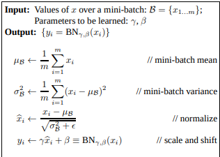
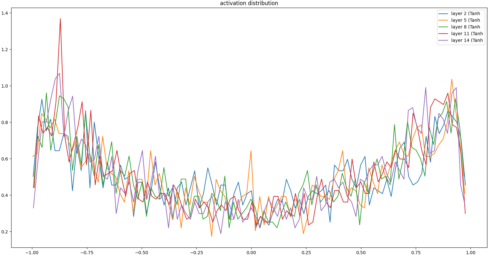
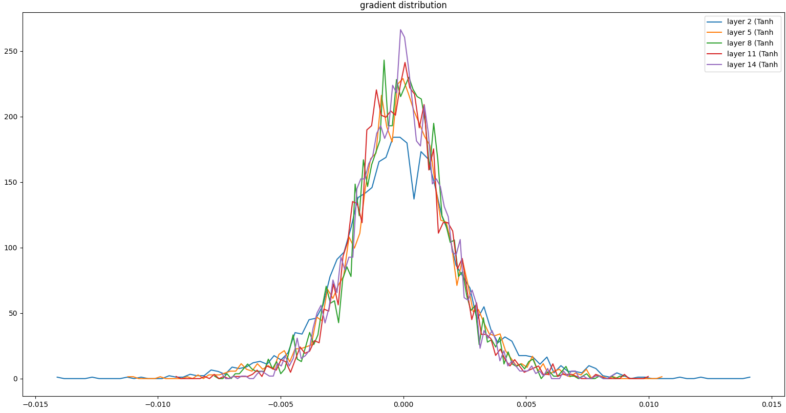
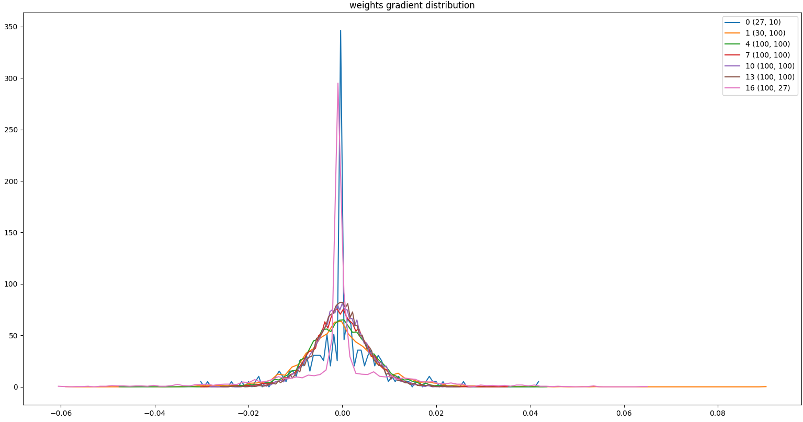
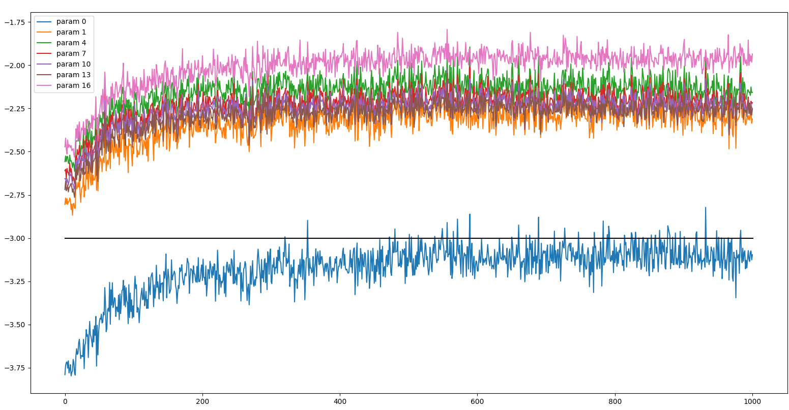

# Batch Normalization 

This repository contains custom PyTorch layer implementations, including Linear, BatchNorm1d, and Tanh layers. These layers can be used in various neural network architectures for tasks such as classification, regression, or language modeling. It is heavily inspired by Karpathy's makemore series and the paper [Batch Normalization: Accelerating Deep Network Training b
y
Reducing Internal Covariate Shift](https://arxiv.org/pdf/1502.03167.pdf) 



## Layers
Linear Layer
The Linear class implements a fully connected linear layer with optional bias. The layer is initialized with random weights sampled from a normal distribution with a mean of 0 and a standard deviation of 1/sqrt(fan_in), where fan_in is the number of input features.

```python
layer = Linear(fan_in, fan_out, bias=True)
```

## BatchNorm1d Layer
The BatchNorm1d class implements a 1-dimensional batch normalization layer. This layer normalizes the input features to have a mean of 0 and a standard deviation of 1 across the batch dimension. It also includes trainable scaling and shifting parameters (gamma and beta) to preserve the model's expressive power.

```python
layer = BatchNorm1d(dim)
```

## Tanh Layer
The Tanh class implements the hyperbolic tangent activation function. This activation function is commonly used in neural networks to introduce non-linearity and improve the model's capacity to learn complex patterns.

```python 
layer = Tanh()
```

## Plots

Andrej explains in his video different plots we can go through to see whether we are in right direction while training the model. He plays with different parameters settings and their effects. The plots are as follows. 

Activation Distribution



Gradient Distribution



Grad to data ratio Distribution



Data-ratio-over-time Distribution


## Usage
To use these custom layers in your PyTorch model, simply import them from the nn.py file:

```python
from nn import Linear, BatchNorm1d, Tanh
```

Then, you can instantiate and use these layers like any other PyTorch module:
```python
linear_layer = Linear(10, 20)
bn_layer = BatchNorm1d(20)
activation_layer = Tanh()

x = linear_layer(input_tensor)
x = bn_layer(x)
x = activation_layer(x)
```
