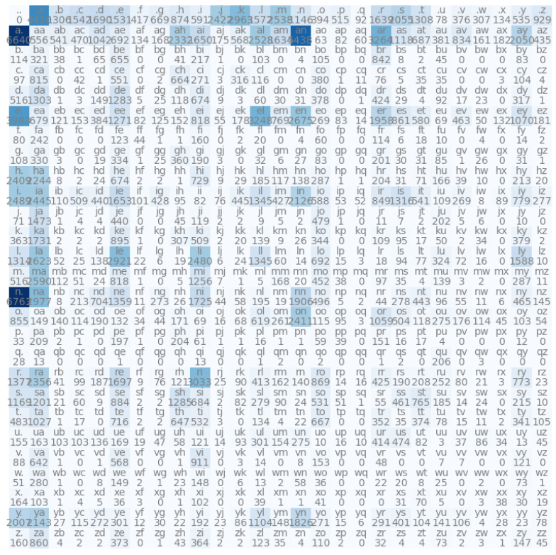
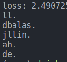
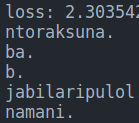

# Character Level Bigram Language Model



This repository contains code for building a character level bigram language model using PyTorch. The model is trained on names text data to predict the probability distribution of characters in a sequence based on the previous character. 

## Introduction
Language models play a crucial role in natural language processing tasks such as speech recognition, machine translation, and text generation. This repository implements a bigram language model using PyTorch, which predicts the likelihood of a character given the previous character in a sequence. The repo also contains code for converting and extracting names from a csv file to a txt file. The code is heavily inspired by Andrej Karpathy's [bigram video](https://www.youtube.com/watch?v=PaCmpygFfXo&list=PLAqhIrjkxbuWI23v9cThsA9GvCAUhRvKZ&index=2). I have further implemented the model on nepali names. The dataset was taken from this repo [Nepali name dataset](https://github.com/amitness/gender-data).

## Features
- Build a bigram language model using PyTorch
- Train the model on text data to predict character probabilities
- Generate text samples from the trained model using multinominal distribution
- Visualize the bigram matrix to analyze character relationships

## Usage
Clone the repo. Install torch.
```pip install torch```

To try out your own set of text dataset, you can then run the following command
```bash
python bigram.py --data <<path to your dataset>>
```

## Outputs
This is the output on the [names.txt](data/names.txt).



This is the output on the [nepali names.txt](data/nepali_names.txt)



The outputs are not so good since it is just a bigram model, but the loss are quite near to the andrej's video.

## References
1. [Andrej Karpathy's bigram video](https://www.youtube.com/watch?v=PaCmpygFfXo&list=PLAqhIrjkxbuWI23v9cThsA9GvCAUhRvKZ&index=2).
2. [Nepali name dataset](https://github.com/amitness/gender-data).