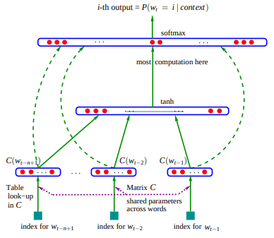
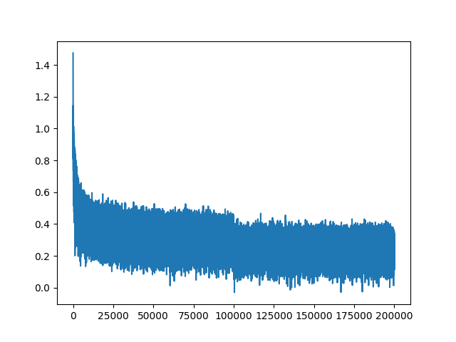
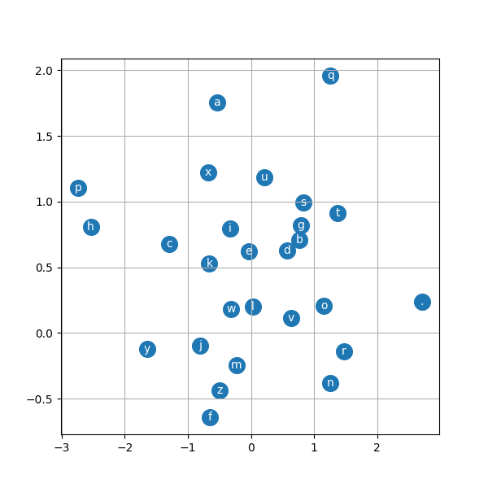
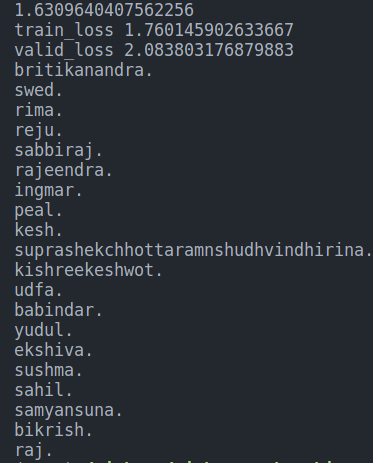

# MLP Char-Level Language Model
This is an implementation of a multilayer perceptron(MLP) character-level language model inspired by Andrej Karpathy's "makemore" video series (Part 2). The model is trained to predict the next character in a sequence of text, given the previous characters as context.



## Description
The model uses a simple neural network architecture with an embedding layer, a single tanh hidden layer, and a linear output layer. The input data is a text file containing words or sentences, which is preprocessed to create a vocabulary of unique characters.

During training, the model learns to predict the next character in a sequence by minimizing the cross-entropy loss between its predictions and the true character labels. The model is trained on a subset of the data, and its performance is evaluated on a validation and test set.

After training, the model can be used to generate new text by sampling from its output distribution. The generated text is character-level, meaning it outputs one character at a time, using the previously generated characters as context.

## Plots

Loss plot from 0.001 to 1 in 1000 steps


2D Embedding matrix plot


## Outputs
The output from the MLP network is quite better than the bigram model.

## Usage
Prepare your input data as a text file (e.g., input.txt).
Run the script with the path to your input file:

```bash
python char_language_model.py --data input.txt
```

The script will preprocess the data, train the model, evaluate its performance on the validation set, visualize the embedding space, and generate sample text.

## Dependencies
python 
torch
matplotlib

## Credits
This implementation follows the tutorial by Andrej Karpathy in his "makemore" video series (Part 2) on YouTube.

## License
This project is licensed under the MIT License.